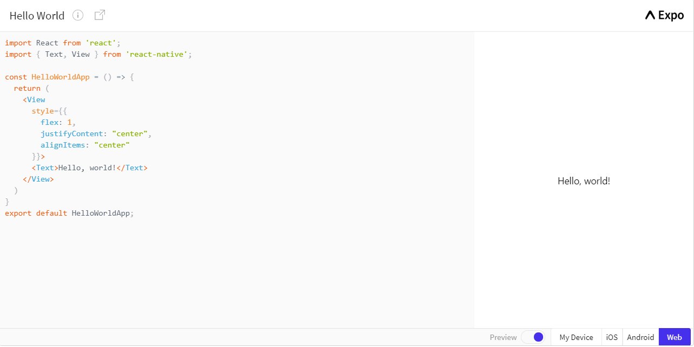

### What is React Native?

React Native is an open-source mobile application framework developed by Facebook for creating native-style apps for iOS & Android under one common language, JavaScript. 

Written in JavaScript—rendered with native code

### Advantages of React Native
1. Write code faster and release faster
2. Friendly for Web (Frontend) Development
3. Fast Refresh
4. Facebook Supported, Community Driven

## How to write react-native app--- Learn the Basics

So to understand the basic structure of a React Native app, you need to understand some of the basic React concepts, like JSX, components

## JSX

## Hello world

